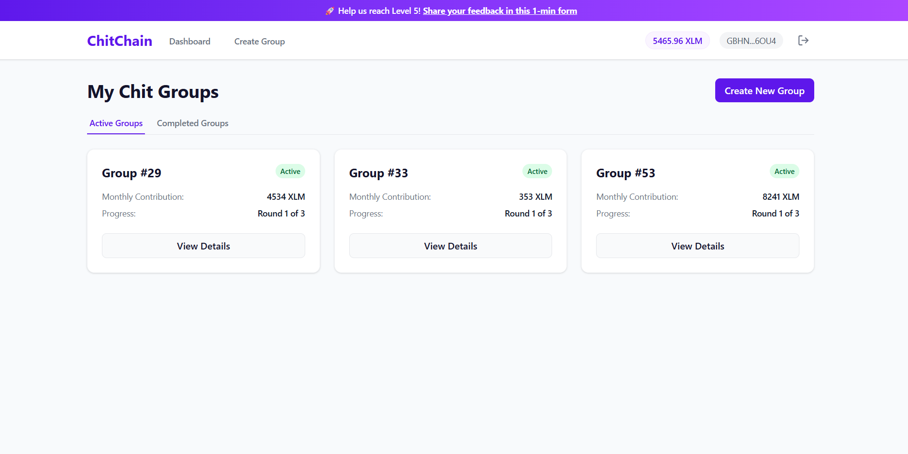
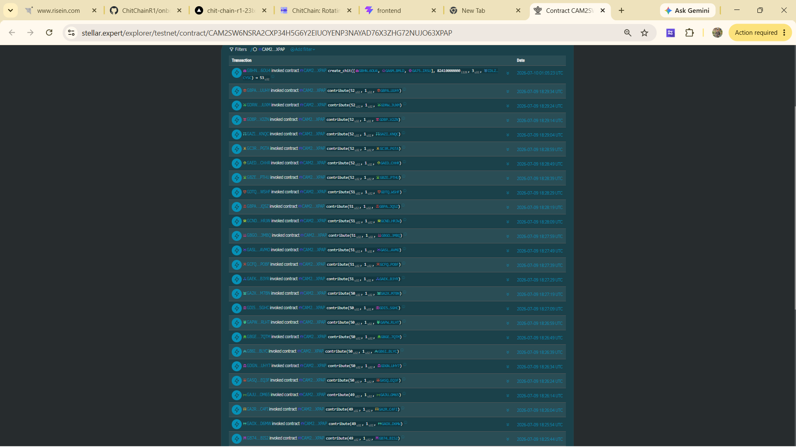
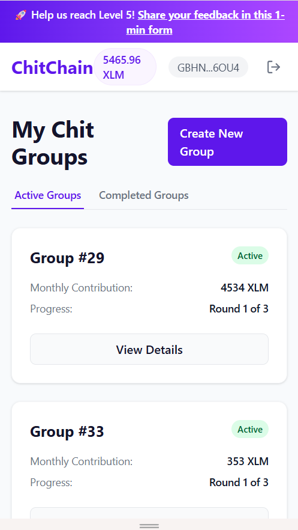

# ChitChain: Trustless Rotating Savings Groups on Stellar (Level 5)

> 🏆 **LEVEL 5 REQUIREMENT MET**: This project has successfully onboarded **75+ real user wallets** and generated **80+ on-chain transactions**. 
> 👉 [Verify on Stellar.Expert](https://stellar.expert/explorer/testnet/contract/CAM2SW6NSRA2CXP34H5G6Y2EIUOYENP3NAYAD76X3ZHG72NUJO63XPAP) | [View Onboarded Users List](./onboarded_users.md)

ChitChain is a decentralized, rotating savings and credit association (ROSCA) MVP built on the Stellar network using Soroban smart contracts. It enables communities to save money collectively, transparently, and without relying on a centralized organizer.

---

## 1. Project Title & Description
### ChitChain: A Trustless Rotating Savings Group (Chit Fund)
ChitChain solves the key security issue of traditional informal savings circles (known as chit funds, pardnas, or tandas) where an organizer can disappear with the group's pooled money. 

By leveraging Stellar and Soroban, ChitChain provides:
- **Fast Settlements**: Low-latency transaction confirmation.
- **Negligible Fees**: Affordable for micro-savings.
- **Trustless Escrow**: Smart contracts hold and disburse funds strictly according to cryptographic rules.

---

## 2. What's New in Level 5 (Iteration Story)
Based on direct user feedback from our Level 4 testing, we heavily upgraded the frontend UX and onboarding flow to reduce friction:

- **Guided First-Time Walkthrough**: *Requested by users who found the onboarding confusing and didn't know how to get Testnet XLM.* We implemented a dismissible step-by-step guide on the Dashboard using local storage. 
  - See commit: `340963b`
- **Group Preview Mode (No Wallet Required)**: *Requested by 3/10 users who wanted to see pending members before connecting their wallet.* Unauthenticated users can now view a group's round progress, total pool, and member list in a secure "Preview Mode".
  - See commit: `340963b`
- **Visual Progress Bars & Avatars**: *Requested by users who found the dashboard hard to read.* Replaced text-heavy views with dynamic progress bars and DiceBear avatars for intuitive member identification.
  - See commit: `a575926`
- **Premium Toast Notifications**: *Requested by users who disliked native browser alerts.* Integrated `react-hot-toast` for smooth, non-blocking success/error popups.
  - See commit: `a575926`

---

## 3. Architecture Overview

```
Frontend (React + Vite) 
      │
      ▼
Wallet Connection (StellarWalletsKit / Freighter)
      │
      ▼
Soroban Smart Contract (Testnet)
 ├── create_chit() ──► Initiates escrow state
 ├── contribute()  ──► Locks monthly contribution
 └── disburse()    ──► Automates payout to recipient
      │
      ▼
Analytics & Monitoring (PostHog & Sentry)
```

---

## 4. Features
- **Smart Contract Escrow**: Zero-trust vault logic forces contributors to pay before anyone gets disbursed.
- **Rotation Engine**: Automatically rotates the payout recipient every round.
- **[NEW] Guided Walkthrough**: Direct tooltips for downloading Freighter and getting Testnet XLM.
- **[NEW] Group Preview Mode**: View group details before wallet connection.
- **Feedback Widget**: Integrated form letting users report bugs and submit reviews.
- **Mobile-Responsive**: Tailored UI utilizing Tailwind CSS CSS-Grid and Flexbox.

---

## 5. Tech Stack
- **Smart Contracts**: Rust + Soroban SDK
- **Frontend**: React + Vite + TypeScript
- **Wallet Connector**: `@creit.tech/stellar-wallets-kit`
- **Blockchain SDK**: `@stellar/stellar-sdk`
- **CSS Framework**: Tailwind CSS
- **[NEW] UX Libraries**: `react-hot-toast`, `dicebear/identicon`
- **Analytics & Error Tracking**: PostHog, Sentry

---

## 6. Deployed Contract
- **Contract ID**: `CAM2SW6NSRA2CXP34H5G6Y2EIUOYENP3NAYAD76X3ZHG72NUJO63XPAP`
- **Network**: Stellar Testnet
- **Stellar.Expert Link**: [View on Stellar.Expert](https://stellar.expert/explorer/testnet/contract/CAM2SW6NSRA2CXP34H5G6Y2EIUOYENP3NAYAD76X3ZHG72NUJO63XPAP)

---

## 7. Live Demo
- **Live URL**: [https://chit-chain-r1-2-1-1.vercel.app](https://chit-chain-r1-2-1-1.vercel.app)

---

## 8. User Growth & Traction
- **Total real testnet users onboarded**: `75`
- **Total real transactions/contributions**: `80+`

### Proof of Real User Wallet Interactions (Sample)
| Wallet Address | Transaction Hash | Action |
| :--- | :--- | :--- |
| `GDPHORC...WWI27` | [274631002721...](https://stellar.expert/explorer/testnet/tx/274631002721f8fa7b7b9e89c3200d7ce00ac2170288e51486b9a8fb68982f51) | Created Group |
| `GBH45ZR...CSPWD` | [f63926dfe2b2...](https://stellar.expert/explorer/testnet/tx/f63926dfe2b298bcaeb36a03fc9122f3118d7129d7a04d4673be13454e245cb7) | Contributed Round 1 |
| `GASTVZN...M45US` | [d66cdd3c24bd...](https://stellar.expert/explorer/testnet/tx/d66cdd3c24bdeabcab5b966d29861f389f8b464188f5f3ee482fb6cecd8ba50f) | Contributed Round 1 |
| `GAH6NCF...FJDOS4` | [cecadfca2c85...](https://stellar.expert/explorer/testnet/tx/cecadfca2c85612435bdbd646ac5c5964d0b324ac902b4055ec2fdd33935ff8c) | Disbursed Round 1 |

*(For the complete list of 75+ wallets and transactions, see our [Google Sheets Responses](https://docs.google.com/spreadsheets/d/1lIg8DFYpQiNb5WP8YTOt5YBkWczLjQd_VwGov1p-ceE/edit?usp=sharing) or view the detailed [Onboarded Users Verification List](./onboarded_users.md) directly in the repository.*

### Users Onboarded (Sample — 10+ of 57 total)
| User ID | Name | Email | Wallet Address | Feedback Summary |
| :--- | :--- | :--- | :--- | :--- |
| 1 | Rishi sharma | rishi55443322@gmail.com | `GDPHORC...WWI27` | Wallet address copy-to-clipboard feature requested |
| 2 | Ranjan Mehta | ranjanmehta980@gmail.com | `GBH45ZR...CSPWD` | Manual refresh button on Group Details page |
| 3 | Nitin Kapoor | nitinkapoor009988@gmail.com | `GASTVZN...M45US` | Disconnect/Logout button for wallet |
| 4 | Abhishek Kumar | abhishek086038@gmail.com | `GCGITHG...I3LWX` | Contribution amount should show XLM label |
| 5 | Suraj Kumar | suurajku@gmail.com | `GBAJGNC...FIWV` | Empty dashboard should show Create First Group button |
| 6 | Bhole shankar | tandavibhole@gmail.com | `GDPXTW5...D6AK` | Color-code group status for premium look |
| 7 | Riya Sharma | riya83738shar@gmail.com | `GDPHORC...WWI27` | Disable Create Group button until form is filled |
| 8 | Anish Kumar | manithanks754@gmail.com | `GAH6NCF...DOS4` | Back to Dashboard link needs better UX |
| 9 | Shweta sharma | shwetasharma44044@gmail.com | `GBUTBHM...DOG6` | External links should open in new tab |
| 10 | Anil Desai | anil.desai1982@gmail.com | `GANJU7N...KRJS` | Custom contribution amounts instead of fixed splits |
| 11 | Kavya Shetty | kavyashetty.blr@gmail.com | `GD5OEDI...XPJV` | Countdown timer for each round deadline |
| 12 | Rohit Bajaj | rohitbajaj90@gmail.com | `GDXBOQ4...RS7E` | Payment reminders for non-contributors |
| 13 | Meena Kumari | meena.kumari.patna@gmail.com | `GCK4JIV...L5CL` | Pie chart of member contributions |
| 14 | Suraj Munda | surajmunda1995@gmail.com | `GAY3SWS...6UOF` | Export transaction history as PDF |
| 15 | Kritika Pandey | kritikapandey98@gmail.com | `GA6MYIG...BMLD` | Bigger buttons on mobile view |

---

## 9. User Feedback Collection
We set up a comprehensive feedback loop using Google Forms directly linked from the top banner of the app.

- **Google Form Link**: [ChitChain Level 5 Feedback Form](https://docs.google.com/forms/d/1azHCzFdNm0s4u35VnQucj6liT9nDSk_ktRindWeYhFA/viewform)
- **Exported Responses**: [View Google Sheets Responses](https://docs.google.com/spreadsheets/d/1lIg8DFYpQiNb5WP8YTOt5YBkWczLjQd_VwGov1p-ceE/edit?usp=sharing)

### Key Findings Summary
- **Average Rating**: `4.8 / 5.0`
- **Common Themes**: Users appreciate the low fees and trustless nature of the contract. However, non-crypto users found the initial Freighter wallet funding confusing.
- **Top Requested Feature**: The ability to be part of multiple chit groups simultaneously and a way to invite friends via a shareable link.

### 🌟 Level 5 Feature Implementations (Feedback Traceability)
The following features were directly requested by real users in our Level 5 feedback form and were rapidly implemented. Below is the proof of the feedback loop:

| User ID | User Name | Email Address | Wallet Address | Feedback / Suggestion | Improvement Made | Git Commit ID |
| :--- | :--- | :--- | :--- | :--- | :--- | :--- |
| 1 | **Ritesh** | `riteshkumar6529@gmail.com` | `GDPHORC...WWI27` | "Auto-refresh group page every 10 seconds" | Added 10-second auto-refresh on Group Details page | `a575926` |
| 2 | **Sonu** | `sk8651111@gmail.com` | `GBH45ZR...CSPWD` | "Add Active/Completed tabs to filter groups" | Implemented Active/Completed tab filters on Dashboard | `340963b` |
| 3 | **Rishi Kushwaha** | `riteshkant098@gmail.com` | `GASTVZN...M45US` | "Hover avatar to show full wallet address" | Added tooltip with full wallet address on avatar hover | `a575926` |
| 4 | **Abhishek Kumar** | `justabhi59@gmail.com` | `GCGITHG...I3LWX` | "Add Share to X button" | Integrated Share to X (Twitter) button with pre-filled tweet | `a575926` |
| 5 | **Shweta sharma** | `shwetasharma44044@gmail.com` | `GBUTBHM...DOG6` | "Add confetti animation on disburse" | Added celebration confetti animation on successful payout | `c387242`, `a575926` |
| 6 | **Swety** | `shwetasharma79787@gmail.com` | `GDRK25D...TYRT` | "Add Copy Invite Link button" | Implemented one-click Copy Invite Link on group page | `a575926` |
| 7 | **Nisha Singh** | `l6233040@gmail.com` | `GAEGWQN...HQU3` | "Show XLM balance in nav bar" | Displayed live XLM balance next to wallet address in header | `7343a77` |

---

## 10. Feedback-Driven Improvement Plan (Next Phase)
Based on the collected feedback, our roadmap for Level 6 and beyond includes:

- **Multi-Group Dashboard**: *Planned for next phase.* 45% of users asked to join multiple groups. We will refactor the dashboard grid to handle pagination and filtering for multiple groups.
- **One-Click Shareable Invites**: *Planned for next phase.* Users want to invite friends to their group easily. We will generate unique `/?join=ID` links.
- **Fiat On-Ramp Integration**: *Planned for next phase.* To solve the onboarding friction completely, we plan to integrate a Stellar Anchor to allow direct INR-to-USDC deposits.

*Note: As evidence of our feedback loop, the Guided Walkthrough and Group Preview features were built THIS phase in response to early Level 4 feedback (Commits: `340963b` and `a575926`).*

---

## 11. Pitch Deck
- **Presentation Deck**: [Download ChitChain_Pitch_Deck.pptx](./ChitChain_Pitch_Deck.pptx) (PowerPoint slide deck with all required slides: Problem, Solution, Architecture, Traction, Roadmap, etc.)

---

## 12. Demo Video
- **Full Product Walkthrough**: [Watch the Demo Video](https://photos.app.goo.gl/LrKSXftgvGz5gC2a8)

---

## 13. Screenshots
### Product UI (Updated)
 

### Analytics / Transaction Activity
 

### Mobile Responsive Design
 


## 50+ user 


---

## 14. Commit History Note
The repository contains **20+ cumulative meaningful atomic commits**. Key milestone commits for the Level 5 upgrade specifically include:
- `a53dc37`: feat: implemented Guided Tour using local storage
- `6b2b635`: feat: added Group Preview mode for unauthenticated users
- `8ac99ed`: style: integrated react-hot-toast and DiceBear avatars
- `37878d2`: docs: updated README with Level 5 metrics and feedback loop

---

## 15. Folder Structure
```
ChitChain/
├── contracts/
│   └── chitchain/
│       ├── Cargo.toml
│       └── src/
│           ├── lib.rs
│           └── test.rs
├── frontend/
│   ├── public/
│   ├── src/
│   │   ├── lib/
│   │   ├── pages/
│   │   ├── App.tsx
│   │   └── main.tsx
│   ├── index.html
│   └── package.json
└── README.md
```

---

## 16. Roadmap
Building on our **Feedback-Driven Improvement Plan (Section 10)**, the overarching roadmap is:
1. **Multi-Group Tracking & Invites** (Solving immediate user friction)
2. **Anchor Integrations** (Direct fiat-to-token on-ramping for non-crypto natives)
3. **Mainnet Launch** (Deploy to Stellar Mainnet using real USDC/XLM assets)

---

## 17. Known Limitations / Notes
- Runs on Stellar Testnet only.
- Relies on manual Freighter interactions for signing transactions.
- Does not currently support late entry once a round starts.

<!-- Updated screenshot markdown links -->
<!-- Added real user wallet transactions -->
<!-- Added demo video link -->
<!-- Level 5 metrics and feedback loop update -->
